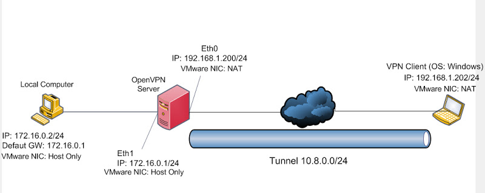
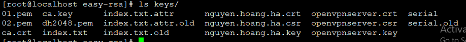
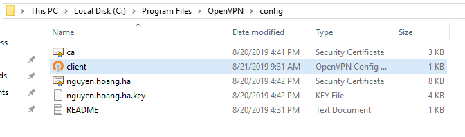
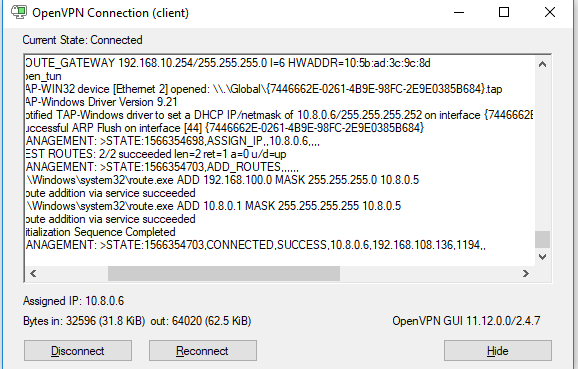
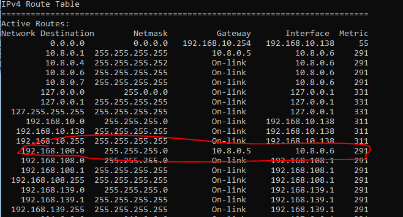

# OPENVPN Client to Side
## Cài đặt
 - Mô hình
 
 - IP Public Server: 192.168.1.136
 - Dải tunner: 10.8.0.0/24
 - Dải Private: 192.168.100.0/24
### Tải source
```
yum install epel-release -y
yum install openssl pam openssl-devel  pam-devel net-tools gcc cmake -y
wget http://www.oberhumer.com/opensource/lzo/download/lzo-2.10.tar.gz
wget https://build.openvpn.net/downloads/releases/openvpn-2.3.18.tar.gz
wget https://build.openvpn.net/downloads/releases/easy-rsa-2.3.3_master.tar.gz
```
### Cài đặt phần mềm
```
tar -xvzf lzo-2.10.tar.gz
cd lzo-2.10
./configure (kiểm tra các thư viện đã đủ chưa)
make (thực hiện biên dịch)
make install (thực hiện cài đặt)

tar -xvzf openvpn-2.3.18.tar.gz
cd openvpn-2.3.18
./configure (kiểm tra các thư viện đã đủ chưa)
make (thực hiện biên dịch)
make install (thực hiện cài đặt)
```
### Tạo thư mục và chuyển vị trí tool easy 
Thư mục gốc sẽ là /etc/openvpn
```
mkdir /etc/openvpn
tar -xvzf easy-rsa-2.3.3_master.tar.gz
cp -r /root/easy-rsa-2.3.3_master/easy-rsa/ /etc/openvpn/
cd /etc/openvpn/easy-rsa/2.0/
mv * ../ (move toàn bộ file trong thư mục 2.0/ ra thư mục easy-rsa/)
cd /etc/openvpn/easy-rsa/  
mkdir keys (tạo thư mục /etc/openvpn/easy-rsa/keys để chứa keys, certificate)
vim /etc/openvpn/easy-rsa/vars (sửa các thông số mặc định hoặc có thể bỏ qua bước này, dùng thông số mặc định)
```
### Tạo CA Certificate Server và Key
Tạo  Root Cerificate
```
/etc/openvpn/easy-rsa
source vars
./clean-all #Chỉ chạy 1 lần đầu tiên. Nó sẽ xóa toàn bộ key trong thư mục keys
./pkitool --keysize 4096 --initca
```
Chạy xong sẽ sinh ra 2 file *ca.crt* và *ca.key* trong thư mục keys
Tạo Server Certificate
```
 ./build-key-server openvpnserver
 ```
Chạy xong sẽ sinh ra 3 file *openvpnserver.crt*, *openvpnserver.csr*, *openvpnserver.key* trong thư mục keys
Tạo Diffie Hellman ( DH ): băm keys
```
./build-dh
```
### Tạo Certificate và Key cho User (Mỗi user thì lặp lại quá trình này)
```
./build-key nguyen.hoang.ha
```
Chạy xong sẽ sinh ra 3 file *nguyen.hoang.ha.crt*, *nguyen.hoang.ha.csr*, *nguyen.hoang.ha.key* trong thư mục keys

## Cấu hình port forwarding. Dùng để Lan Routing
Thêm tham số sau vào sysctl
```
vim /etc/sysctl.conf
net.ipv4.ip_forward = 1
sysctl -p (để cho các thông số có hiệu lực)
```
## Cấu hình server
 - Copy file mẫu
```
cp /root/openvpn-2.3.18/sample/sample-config-files/server.conf /etc/openvpn/
```
- Sửa cấu hình
```
vim /etc/openvpn/server.conf 
local 192.168.1.200 (chọn card mạng user quay VPN đến, có thể không cần option này)
port 1194 (OpenVPN sẽ listen ở port này)
proto udp (protocol udp)
dev tun (dùng tunnel, nếu dùng theo bridge chọn dev tap0 và những config khác sẽ khác với tunnel)
ifconfig-pool-persist ipp.txt
ca /etc/openvpn/easy-rsa/keys/ca.crt
cert /etc/openvpn/easy-rsa/keys/openvpnserver.crt
key /etc/openvpn/easy-rsa/keys/openvpnserver.key
dh /etc/openvpn/easy-rsa/keys/dh2048.pem
server 10.8.0.0 255.255.255.0 (khai báo dãy IP cần cấp cho VPN Client, mặc định VPN Server sẽ lấy .1)
push “route 172.16.0.0 255.255.255.0” (lệnh này sẽ đẩy route mạng 172.16.0.0 đến Client)
client-config-dir ccd (dùng để khai báo cấp IP tĩnh cho VPN Client - Tùy chọn)
client-to-client (cho phép các VPN client nhìn thấy nhau, mặc định client chỉ thấy server - Tùy chọn)
push “redirect-gateway” (mọi traffic của VPN Client – http, dns, ftp, … đều thông qua đuờng Tunnel. 
Khác với lệnh push route, chỉ những traffic đi vào mạng nội bộ mới thông qua Tunnel, khi dùng lệnh này 
yêu cầu bên trong mạng nội bộ cần có NAT Server, DNS Server)
push “dhcp-option DNS (WINS) 10.8.0.1” đẩy DNS or WINS config vào VPN Client
comp-lzo
```
## Start Server
```
openvpn server.conf
 OpenVPN 2.3.18 x86_64-unknown-linux-gnu [SSL (OpenSSL)] [LZO] [EPOLL] [MH] [IPv6] built on Aug 19 2019
 library versions: OpenSSL 1.0.2k-fips  26 Jan 2017, LZO 2.10
 Diffie-Hellman initialized with 2048 bit key
 WARNING: file '/etc/openvpn/easy-rsa/keys/openvpnserver.key' is group or others accessible
 Socket Buffers: R=[212992->212992] S=[212992->212992]
 ROUTE_GATEWAY 192.168.108.2/255.255.255.0 IFACE=ens33 HWADDR=00:0c:29:6a:7f:5c
 TUN/TAP device tun0 opened
 TUN/TAP TX queue length set to 100
 do_ifconfig, tt->ipv6=0, tt->did_ifconfig_ipv6_setup=0
 /usr/sbin/ifconfig tun0 10.8.0.1 pointopoint 10.8.0.2 mtu 1500
 /usr/sbin/route add -net 10.8.0.0 netmask 255.255.255.0 gw 10.8.0.2
 UDPv4 link local (bound): [undef]
 UDPv4 link remote: [undef]
 MULTI: multi_init called, r=256 v=256
 IFCONFIG POOL: base=10.8.0.4 size=62, ipv6=0
 Initialization Sequence Completed
```
## Cài đặt và quay vpn từ Client Windows
 - Down phần mềm và cài đặt từ link http://build.openvpn.net/downloads/releases/latest/openvpn-install-latest-stable.exe
 - Thư mục gốc sẽ là *C:\Program Files\OpenVPN*
 - Trong thư mục config tạo 1 file *client.ovpn*
```
client
dev tun
proto udp
remote 192.168.108.136 1194
resolv-retry infinite
nobind
persist-key
persist-tun
ca ca.crt
cert nguyen.hoang.ha.crt
key nguyen.hoang.ha.key
cipher AES-256-CBC
comp-lzo
verb 3
```
 - Copy 3 file cer và key như trên từ server đặt vào thư mục *config*
 - Thực hiện quay VPN và kiểm tra kết quả



## Thêm Openvpn vào Systemd
### Tạo file script start/stop dịch vụ
```
vim /usr/local/bin/openvpn
#!/bin/bash
# Location: /etc/openvpn

function start_openvpn () {
    if [ -f /var/run/openvpn.pid ] ; then
        echo "Service is running"
	exit 0
    else
	echo "Echo: starting service openvpn server"
  	sleep 1
  	nohup /usr/local/sbin/openvpn  /etc/openvpn/server.conf > /dev/null 2>&1 &
  	echo $! > /var/run/openvpn.pid
  	echo "Echo: starting done"
    fi
}

function stop_openvpn () {
   if [ ! -f /var/run/openvpn.pid ] ; then
	echo "Service is not running"
	exit 0
   else
	echo "Echo: stopping service openvpn server"
	PID=`/usr/bin/cat /var/run/openvpn.pid`
        kill -9 $PID
        /usr/bin/rm -rf /var/run/openvpn.pid
        sleep 1
        echo "Echo: stopping done"
   fi
}

function status_openvpn () {
  echo "Echo service"
}

case "$1" in
  'start')
       start_openvpn
    ;;
  'stop')
    stop_openvpn
    ;;
  'restart')
    if [ -f /var/run/openvpn.pid ] ; then
        stop_openvpn
	sleep 1
	start_openvpn
    else
        start_openvpn
    fi
    ;;
  'status')
    status_openvpn
    ;;
  *)
    echo "Usage: $0 {start|stop|status|restart}" >&2
    ;;
esac
```
### Tạo file openvpn.service
```
vim /etc/systemd/system/openvpn.service
[Unit]
After=syslog.target network-online.target
Wants=network-online.target
Description=OpenVPN Server

[Service]
Type = forking
ExecStart=/usr/local/bin/openvpn start
ExecStop=/usr/local/bin/openvpn stop
ExecReload=/usr/local/bin/openvpn restart

[Install]
WantedBy = multi-user.target
```
## Cấu hình Openvpn xác thực với Ldap
- Cài thêm gói 
```
yum install -y openvpn-auth-ldap
```
- File cấu hình vpn server thêm
```
plugin /usr/lib64/openvpn/plugin/lib/openvpn-auth-ldap.so /etc/openvpn/auth/ldap.conf
```
- Trên Ldap tạo 1 user *openvpn*. Sau khi tạo kiểm tra thông tin user có infor như dưới
```
dn: uid=openvpn,ou=People,dc=sun-asterisk,dc=com
```
- Cấu hình file /etc/openvpn/auth
```
<LDAP>
	URL		ldap://localhost:389

	BindDN		uid=openvpn,ou=People,dc=sun-asterisk,dc=com
 	Password	hoangha1908
	Timeout		15
	TLSEnable	no
	FollowReferrals yes
</LDAP>
<Authorization>
	BaseDN		"ou=People,dc=sun-asterisk,dc=com"
	SearchFilter "(&(uid=%u))"
	RequireGroup	false
</Authorization>
```
- File cấu hình client.ovpn thêm cấu hình
```
auth-user-pass
```
## Ràng buộc Client đăng nhập user trùng với user key vpn
- Theo như cấu hình trên thì Client đăng nhập bằng user nào cũng được (user trên ldap) mà không quan tâm tới đang dùng key vpn tên gì
- Giờ ta sẽ ràng buộc như key hoangha sẽ phải xác thực bằng user hoangha
- Thêm 1 file script check username (ldap) có khớp với common_name (certificate_client) có giống nhau không. Nếu giống thì trả về OK (code 0), ngược lại là Fail (code 1)
```
vim check_cn_on_connect.sh
#!/bin/bash
if [ $username != $common_name ]; then
   exit 1
fi
exit 0
```
- Thêm đoạn script trên vào *server.conf*
```
script-security 2
auth-user-pass-verify /etc/openvpn/check_cn_on_connect.sh via-env
```

